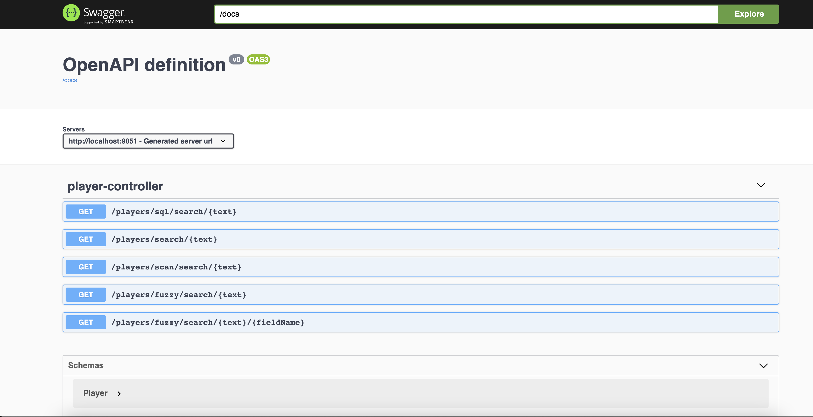

# Sample Spring Boot Application for Querying Apache Ignite Cache

The purpose of this project is to demonstrate how we can query the data stored in the Cache
of [Apache Ignite](https://ignite.apache.org/docs/latest/) using query API.

This project uses [Spring Boot](https://spring.io/projects/spring-boot) version 2.5.6
and [GridGain](https://www.gridgain.com/docs/latest/getting-started/what-is-gridgain) version 8.8.10

# How to build and run

project can be compiled with JDK 8 and above `javac`.

To compile just do `mvn clean package`.

## Prerequisites

* JAVA 8 should be installed

To run the application execute the following:

```
java -jar target/ignite-poc*.jar
```

You can also use the Swagger-UI to test the application.


for more detailed technical information please check my post : <>

The server will start at <http://localhost:9051>.

## Exploring the Rest APIs

The Swagger UI will open at : <http://localhost:9051/swagger-ui.html>

The application contains the following REST APIs

```
1. GET /players/sql/search/{text} - Search All Players using SqlQuery whose team contains the given text

2. GET /players/search/{text} - Search All Players using TextQuery where either name or team contains the given text

3. /players/scan/search/{text} - Search All Players using ScanQuery whose team contains the given text

4. /players/fuzzy/search/{text} - Search All Players using Fuzzy TextQuery where either name or team contains the given text

5. /players/fuzzy/search/{text}/{fieldName} - Search All Players using Fuzzy TextQuery and fieldName where fieldName contain the given text

```


